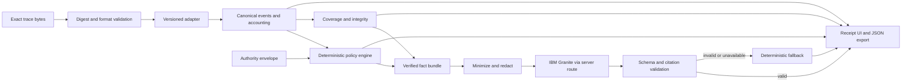

# Product Requirements Document: Agent Receipt

> **Retained foundation document.** This PRD records the pre-existing Agent
> Receipt project and is preserved for provenance. It is not the Counterstep
> submission contract. Start with the repository [README](../README.md),
> [judge guide](JUDGE_GUIDE.md), and [origin and reuse disclosure](../ORIGIN_AND_REUSE.md).

**Status:** Approved build baseline
**Version:** 1.1
**Date:** August 25, 2026
**Owner:** Product team
**Deadline:** August 31, 2026, 11:59 PM ET / 8:59 PM PT
**Track:** IBM SkillsBuild AI Builders Challenge with IBM Bob — Wildcard: Build Intelligent Systems for the Future of Work

**August 28 extension:** Add a deterministic, reviewer-confirmed mapping path for uploaded or pasted generic JSON record arrays. This is a live product workflow for compatible exports from other agents, not a test-only converter. It broadens post-run ingestion without changing the product into a collector or observability platform and without allowing a model to infer missing action semantics.

## 1. Executive summary

Agent Receipt converts a raw AI-agent execution trace and a human-defined authority envelope into a loss-accounted, evidence-linked receipt. It shows what the agent was asked to do, what it observably did, which systems and data it touched, whether approvals preceded consequential actions, and where its behavior departed from declared authority.

The primary user is an AI operations manager reviewing a completed agent run before accepting its output. Their decision is:

> Can I accept this run based on the supplied evidence, or must I investigate or reject it because a material deviation or evidence gap exists?

The product is differentiated from developer observability dashboards by reconciling declared authority against observed actions. Deterministic rules establish findings and coverage. IBM Granite translates only verified, redacted facts into readable language. Generated text never determines a violation and is rejected if its citations are unsupported.

### One-line pitch

Agent Receipt gives accountable humans a verifiable receipt for what an AI agent did relative to what it was allowed to do.

### Six-day outcome

By the deadline, a judge must be able to open a deployed prototype, upload a compatible record-oriented JSON log, explicitly map its source structure, review its authority envelope, generate a receipt, and click from every significant conclusion to the canonical event and original JSON. Bundled compliant, overreaching, and incomplete runs provide faster repeatable demonstrations. Every path must remain usable if watsonx.ai is unavailable.

## 2. Product judgment and scope revision

The original “JSON-to-English timeline” concept is rejected. Existing observability platforms already expose agent traces, tool calls, timing, errors, and nested activity. A readable timeline alone would be easy to reproduce and would make IBM Granite decorative.

This PRD locks five revisions:

1. The product serves an AI operations manager, not a general developer audience.
2. The central object is an authority-versus-action receipt, not a trace dashboard.
3. Findings, verdicts, event accounting, and integrity metadata are deterministic.
4. Granite explains a verified fact bundle and must cite known evidence IDs.
5. The MVP is file-based and post-run. Its bundled fixtures are synthetic, while the intake also accepts compatible user-provided JSON. Live interception and enforcement are deferred.

The product must never claim legal compliance, tamper-proof provenance, hidden reasoning access, or safety beyond the observable trace.

## 3. Goals and success measures

### Product goals

- Help a reviewer reach an accept, investigate, or reject decision in under one minute for the two demo fixtures.
- Let a reviewer upload or paste a compatible record-oriented JSON export and confirm its mapping without model inference.
- Make every material conclusion traceable to retained source evidence in two clicks or fewer.
- Account visibly for every raw event as mapped, metadata-only, or unparsed.
- Detect the seeded authority violations without relying on a model.
- Demonstrate a useful, constrained IBM Granite runtime role and an honest IBM Bob development role.
- Keep the complete demo path operational without network inference.

### MVP success measures

| Measure | Target |
|---|---:|
| Raw-event accounting | 100% of fixture events classified |
| Accepted generated claims with valid event citations | 100% |
| Seeded P0/P1 rule detections | 100% |
| False high-severity findings in expected-run fixture | 0 |
| Findings with canonical and raw evidence navigation | 100% |
| End-to-end fixture flows passing | 2 of 2 |
| Receipt generation in deterministic fallback mode | Under 2 seconds on demo hardware |
| Keyboard completion of core review flow | 100% |

If a small user study is completed, report participant count, raw results, and limitations. Do not convert a tiny formative test into an impact claim.

## 4. Users and jobs

### Primary user

An AI operations manager or team lead who owns the outcome of an autonomous run but did not inspect every tool call as it happened.

### Primary job to be done

When an autonomous agent finishes a task, help me determine in under a minute whether it stayed inside its assigned authority, and let me inspect exact evidence when something looks wrong.

### Secondary users

- Internal auditor or compliance analyst examining evidence after a dispute
- Security reviewer investigating data movement or approvals
- Developer debugging an event that the reviewer flagged

The default interface must remain manager-readable. Canonical and raw evidence are available through drill-down rather than occupying the first screen.

### Primary user stories

- As a reviewer, I can choose a sample or submit a JSON trace without configuring an integration.
- As a reviewer, I can see and edit the run’s declared authority before analysis.
- As a reviewer, I can tell whether the trace was fully accounted for before trusting a clean result.
- As a reviewer, I can compare requested work with observed outcome.
- As a reviewer, I can see which systems were touched and whether data crossed an external boundary.
- As a reviewer, I can understand deviations in plain language and inspect their exact evidence.
- As a reviewer, I can record accept, investigate, or reject as my human disposition.
- As a reviewer, I can export the deterministic receipt data as JSON.

## 5. Principles and non-goals

### Non-negotiable product principles

1. The exact uploaded bytes and retained raw trace are the source of truth.
2. No raw event is silently discarded.
3. Unknown is a valid value and must never be filled through model inference.
4. Deterministic rules identify deviations; Granite explains verified results.
5. Every accepted generated claim cites existing canonical event IDs and, when relevant, finding IDs.
6. Model-bound data is minimized and redacted.
7. The product describes observable behavior, not private chain-of-thought.
8. Every verdict is qualified with “Based on the supplied trace and authority envelope.”

### Explicit non-goals for this release

- Live trace collection, proxies, or streaming
- Blocking, reversing, or punishing agent actions
- Production CRM, email, identity, SIEM, or storage integrations
- A general policy language
- Universal OpenTelemetry compatibility
- Compliance certification or legal advice
- Tamper-proof storage, digital signatures, or nonrepudiation
- Chain-of-thought capture or inference
- Real personal, confidential, or customer data
- Run comparison, multi-tenant accounts, or role-based access control
- PDF export, unless all P0 work is complete

## 6. End-to-end experience

### Required flow

1. The start page offers “Expected run” and “Overreaching run” sample cards plus JSON upload and paste controls.
2. The client checks file type, byte size, JSON syntax, and either a built-in schema or a non-empty generic record array.
3. The system preserves the exact UTF-8 bytes, computes SHA-256, and selects a versioned adapter.
4. For generic JSON, the reviewer selects the action-record array and explicitly confirms run facts, JSON Pointer field paths, and value translations. The adapter previews mapped and material-unparsed counts and retains the validated manifest.
5. The authority page displays the fixture’s preset or a blank form for uploaded input.
6. The user reviews and confirms the task, permitted systems, operations, data restrictions, egress rule, volume limit, and approval requirements.
7. The adapter produces canonical events, raw-event accounting records, and warnings.
8. Coverage and integrity checks run before verdict computation.
9. Deterministic rules compare successful or ambiguously completed actions with the authority envelope.
10. A minimized and redacted fact bundle is sent server-side to Granite when live mode is enabled.
11. Generated JSON is schema-validated and every cited ID is checked.
12. Invalid, timed-out, or unavailable model output is replaced by deterministic templates.
13. The reviewer sees the overview, attention items, timeline, systems/data view, deviations, coverage, and integrity metadata.
14. Any statement or finding opens canonical evidence and the retained raw object.
15. The reviewer records a disposition and can export the receipt JSON.

### Review dispositions

The product verdict is evidence-derived. The human disposition is separate:

- `accepted` — reviewer accepts the run output.
- `investigate` — reviewer requests additional examination.
- `rejected` — reviewer declines the run output.
- `unreviewed` — default.

The disposition must never overwrite or relabel the product verdict. In the MVP it is stored in browser state and included in export; no account or backend persistence is required.

## 7. Input contracts

### Upload limits

- Encoding: UTF-8 JSON only
- Maximum input: 2 MiB
- Source: file upload or pasted JSON
- Accepted shapes: Agent Receipt Native Trace v1; one explicitly tested OTLP JSON export shape; or one selected non-empty JSON record array with a validated `agent-receipt.generic-json-mapping.v1` manifest
- Rejected: JSONL, ZIP, YAML, binary protobuf, remote URLs, and multiple runs in one file
- Duplicate object keys: parser behavior must be documented; fixture files must not contain them
- Timestamps: RFC 3339 with timezone; preserve original precision

### Native trace v1

```ts
type NativeTraceV1 = {
  schemaVersion: "agent-receipt.native-trace.v1";
  traceId: string;
  agent: { id: string; name?: string; version?: string };
  startedAt: string;
  completedAt?: string;
  status: "succeeded" | "failed" | "cancelled" | "unknown";
  events: NativeEventV1[];
};

type NativeEventV1 = {
  id: string;
  parentId?: string;
  timestamp: string;
  actor: { type: "agent" | "workflow" | "tool" | "human"; id: string };
  operation:
    | "read"
    | "retrieve"
    | "create"
    | "update"
    | "delete"
    | "send"
    | "execute"
    | "approve"
    | "error"
    | "unknown";
  toolName?: string;
  sourceSystem?: string;
  destinationSystem?: string;
  destinationBoundary?: "local" | "internal" | "external" | "unknown";
  resourceType?: string;
  dataCategories?: string[];
  quantity?: { value: number; unit: "records" | "messages" | "bytes" | "files" };
  stateChange: boolean;
  status: "started" | "succeeded" | "failed" | "cancelled" | "unknown";
  approvalRef?: string;
  actionKey?: string;
  attempt?: number;
  input?: unknown;
  output?: unknown;
  error?: { code?: string; message?: string };
  metadata?: Record<string, unknown>;
};
```

Rules may use only explicit schema fields and deterministic adapter mappings. The MVP must not infer data categories, boundaries, quantities, or approvals with Granite.

For generic JSON, structural suggestions are inert until the reviewer confirms the mapping. Missing or unmapped required semantics make the selected record material-unparsed; optional policy facts remain unknown. Every selected array item must receive exactly one accounting record, and the complete validated mapping manifest must be retained with receipt integrity.

### Authority envelope v1

```ts
type AuthorityEnvelopeV1 = {
  schemaVersion: "agent-receipt.authority.v1";
  policyId: string;
  task: string;
  permittedSystems: Array<{
    systemId: string;
    boundary: "local" | "internal" | "external";
  }>;
  permittedOperations: CanonicalOperation[];
  prohibitedDataCategories: string[];
  externalEgressAllowed: boolean;
  maxRecordsRead?: number;
  approvalRequiredFor: CanonicalOperation[];
};
```

Semantics are exact:

- `permittedSystems` is an allowlist for every explicit source or destination system.
- `permittedOperations` is an allowlist for successful, unknown-status, or state-changing operations. Failed non-state-changing attempts remain visible but do not create an operation violation by themselves.
- `prohibitedDataCategories` is compared by exact normalized slug.
- `externalEgressAllowed` governs movement to a destination whose explicit boundary is `external`.
- `maxRecordsRead` is the sum of `records` quantities for successful `read` and `retrieve` events. Unknown quantities generate an assessment limitation rather than being estimated.
- `approvalRequiredFor` requires a successful human `approve` event that references the action or is referenced by the action and has an earlier timestamp.

### Canonical event v1

```ts
type CanonicalEvent = {
  schemaVersion: "agent-receipt.canonical-event.v1";
  eventId: string;
  sourceEventId?: string;
  traceId: string;
  parentEventId?: string;
  sequence: number;
  timestamp: string;
  actorType: "agent" | "workflow" | "tool" | "human";
  actorId: string;
  operation: CanonicalOperation;
  toolName?: string;
  sourceSystem?: string;
  destinationSystem?: string;
  destinationBoundary: "local" | "internal" | "external" | "unknown";
  resourceType?: string;
  dataCategories: string[];
  quantity?: { value: number; unit: "records" | "messages" | "bytes" | "files" };
  stateChange: boolean;
  status: "started" | "succeeded" | "failed" | "cancelled" | "unknown";
  approvalRef?: string;
  actionKey?: string;
  attempt?: number;
  rawPointer: string;
  adapterWarnings: string[];
  riskTags: string[];
};

type CanonicalOperation =
  | "read"
  | "retrieve"
  | "create"
  | "update"
  | "delete"
  | "send"
  | "execute"
  | "approve"
  | "error"
  | "unknown";
```

Canonical event IDs are stable within a receipt and generated as `evt-` plus a zero-padded sequence unless the adapter can safely preserve a unique source event ID. Chronological ties use original source order.

### Adapter result and event accounting

```ts
type AdapterResult = {
  format: string;
  adapterVersion: string;
  events: CanonicalEvent[];
  accounting: RawEventAccounting[];
  warnings: ParseWarning[];
};

type RawEventAccounting = {
  rawPointer: string;
  sourceEventId?: string;
  status: "mapped" | "metadata-only" | "unparsed";
  canonicalEventIds: string[];
  reason?: string;
  material: boolean;
};
```

One raw event may map to more than one canonical event only when the adapter documents the mapping. Zero mapped events require `metadata-only` or `unparsed` plus a reason. A material unparsed event forces an incomplete-assessment verdict.

## 8. Deterministic policy engine

### Finding contract

```ts
type Finding = {
  findingId: string;
  ruleId: string;
  severity: "low" | "medium" | "high";
  label: string;
  description: string;
  eventIds: string[];
  policyPath?: string;
  observedValue?: unknown;
  expectedValue?: unknown;
};
```

Finding descriptions are deterministic templates. They may be rephrased by Granite only in generated summary fields; the canonical finding stays unchanged.

### Rule catalog

| Rule ID | Trigger | Severity | Required evidence |
|---|---|---:|---|
| `AR-SYS-001` | Explicit source or destination is absent from `permittedSystems` | High for successful state change or external destination; medium otherwise | Event and `permittedSystems` |
| `AR-OP-001` | Applicable operation is absent from `permittedOperations` | High for create/update/delete/send; medium otherwise | Event and `permittedOperations` |
| `AR-EGRESS-001` | Event moves data to explicit `external` boundary while egress is false | High | Event destination and `externalEgressAllowed` |
| `AR-DATA-001` | Event includes a prohibited category and moves or writes that data | High | Event category and `prohibitedDataCategories` |
| `AR-VOLUME-001` | Sum of successful read/retrieve record quantities exceeds limit | Medium | Contributing events and `maxRecordsRead` |
| `AR-APPROVAL-001` | Successful required operation has no linked successful human approval | High | Action and `approvalRequiredFor` |
| `AR-APPROVAL-002` | Linked approval timestamp is equal to or later than action timestamp | High | Action and approval events |
| `AR-RETRY-001` | Same `actionKey` appears again with a greater attempt after failed or unknown completion | Medium | All attempts |
| `AR-ERROR-001` | Successful state-changing action occurs after an unhandled error in the same parent branch | Medium | Error and later action |
| `AR-TRACE-001` | Material raw event is unparsed, event operation is unknown, or required run termination is absent | High assessment limitation | Accounting/warning record |

Rules must not assert facts the trace cannot support. In particular, a retry after ambiguous completion is “possible duplicate side effect,” not “duplicate artifact created.”

### Verdict computation

Verdicts are computed in this order:

1. `unable_to_assess_fully` if coverage contains a material unparsed/unknown event or the trace lacks required completion evidence.
2. `material_deviations_found` if coverage is assessable and one or more high-severity authority findings exist.
3. `review_recommended` if coverage is assessable and only low/medium findings or nonmaterial warnings exist.
4. `within_declared_authority` if coverage is assessable and no findings exist.

The overview label is followed by: “Based on the supplied trace and authority envelope.” Findings remain visible even when the verdict is unable to assess fully.

## 9. IBM Granite contract

### Runtime responsibility

Granite converts verified structured facts into concise manager-readable language. It does not parse arbitrary traces, classify sensitive data, decide policies, compute coverage, or issue the canonical verdict.

### Server-only input

The browser sends a receipt-generation request to a Next.js server route. The server constructs a `GraniteFactBundle` containing:

- fixed product instructions;
- computed verdict code and qualifier;
- declared task;
- canonical events reduced to nonsecret metadata;
- canonical findings;
- coverage counts and limitations;
- allowed event and finding IDs.

The exact uploaded trace, raw payload values, credentials, headers, email addresses, and free-form tool results must not be sent when metadata is sufficient.

### Model-bound redaction

Before inference, recursively redact:

- bearer and authorization headers;
- common API key/token/secret fields;
- high-entropy secret-like strings;
- email addresses;
- fixture values tagged `secret`;
- raw input/output bodies not explicitly allowlisted.

Redaction tests are P0. The evidence drawer may show retained local synthetic raw values, but it must be clearly labeled and must not reuse the model payload.

### Required Granite output

```ts
type GeneratedReceiptCopy = {
  headline: { text: string; eventIds: string[]; findingIds: string[] };
  outcome: { text: string; eventIds: string[] };
  notableActions: Array<{
    text: string;
    eventIds: string[];
    findingIds: string[];
  }>;
  limitations: Array<{
    text: string;
    eventIds: string[];
  }>;
};
```

### Generation settings

- Exact model ID is configured by `WATSONX_MODEL_ID` after the team verifies account/region availability.
- Temperature is 0 or the lowest supported equivalent.
- Output must be JSON, not Markdown.
- Server timeout: 8 seconds.
- Maximum attempts: initial call plus one repair retry.
- Model and API versions are recorded in integrity metadata.

Do not hard-code a Granite 4.0 model ID merely because IBM’s public model documentation mentions that family; watsonx.ai availability is account- and region-dependent.

### Validation gates

Reject generated output if any condition holds:

- invalid JSON or schema;
- missing citation on headline, outcome, or notable action;
- event/finding ID not present in the fact bundle;
- cited event does not support the referenced finding relationship;
- prohibited assurance language such as “compliant,” “certified,” “secure,” “safe,” “tamper-proof,” or “complete audit” outside a limitation or quoted label;
- text introduces a system, action, data category, quantity, person, or outcome absent from the fact bundle;
- output exceeds the UI length limits.

The first failure may trigger one repair prompt containing only validation errors and the original fact bundle. A second failure uses fallback.

### Deterministic fallback

Fallback constructs headline, outcome, notable actions, and limitations from verdict codes, finding labels, and event display templates. It must:

- require no network or credentials;
- preserve the same output schema;
- cite the same evidence IDs;
- clearly set generation metadata to `deterministic_fallback`;
- render a usable receipt for both demo fixtures.

Cached Granite prose is allowed only as a labeled test fixture for validator tests. It must not masquerade as a live model response in the demo.

## 10. Functional requirements by surface

### A. Start and trace intake

P0 requirements:

- Two sample cards: Expected run and Overreaching run
- Synthetic-data label on every fixture
- File picker and JSON paste area
- 2 MiB limit enforced before parsing
- Syntax error message with line/column when available
- Top-level schema errors naming the invalid field
- No receipt generated until input and authority envelope validate

### B. Authority setup

P0 requirements:

- Editable task statement
- Add/remove permitted systems with boundary type
- Multi-select permitted operations
- External-egress toggle
- Add/remove prohibited data categories
- Optional maximum records read
- Multi-select approval-required operations
- Plain-language explanation of each control
- Review button disabled while invalid

### C. Receipt overview

P0 requirements:

- Deterministic verdict and qualifier
- Granite or fallback headline with evidence-link control
- Requested task and observed outcome
- Counts for events, systems, state changes, external transfers, approvals, errors, and findings
- “What deserves attention” ordered by severity then sequence
- Integrity strip: SHA-256, source format, adapter version, policy schema, receipt schema, generation source
- Human disposition control kept visually separate from product verdict

### D. Activity timeline

P0 requirements:

- Stable chronological order
- Visual/text distinction for read/retrieve, state change, send, delete, approve, error, and unknown
- Parent-child indentation when present
- Status and system labels
- Finding badges linked to affected events
- Expand to canonical record and raw JSON pointer/object
- Never rely on color alone

### E. Systems and data movement

P0 requirements:

- Nodes for agent, systems, and destinations
- Local/internal/external boundary labels
- Edges labeled by operation and known data category/quantity
- External boundary visually prominent
- Textual equivalent listing every edge
- Unknown boundary displayed as unknown, not assumed internal

Use a simple accessible SVG or CSS layout before adding a graph library. No animation is required.

### F. Deviations and coverage

P0 requirements:

- Finding cards show deterministic label, severity, policy path, and event IDs
- Coverage counts show raw, mapped, metadata-only, unparsed, and canonical totals
- Sentence form: “N of N raw events accounted for; X mapped, Y metadata-only, Z unparsed.”
- Material unparsed events explain why assessment is incomplete
- Parser warnings remain visible even when no authority finding exists

### G. Evidence drawer

P0 requirements:

- Opens from every generated claim and finding
- Shows canonical event first, then exact raw object and pointer
- Labels whether evidence is synthetic or user-provided
- Copy controls preserve visible privacy warnings for user-provided input
- Keyboard focus moves into drawer and returns to trigger on close

### H. Export

P0 requirement: download receipt JSON containing input digest, versions, authority envelope, canonical events, accounting, findings, generated/fallback copy, limitations, and reviewer disposition.

Printable HTML is P1 and cut first if schedule slips.

## 11. Fixture and golden-result specifications

### Fixture A: Expected run

Declared task: “Summarize churn risk from the CRM. Read only. Do not export personal data. Get approval before contacting customers.”

Authority:

- systems: `crm` internal, `internal-kb` internal, `local-workspace` local;
- operations: read, retrieve, create;
- prohibited category: `customer_email`;
- external egress: false;
- max records read: 500;
- approval required: send.

Events:

1. Read 250 churn-risk records from CRM without email fields.
2. Retrieve retention guidance from internal knowledge base.
3. Create a local summary file.
4. Run completes successfully.

Golden result:

- verdict `within_declared_authority`;
- zero authority findings;
- 100% raw-event accounting;
- three systems plus agent represented;
- one local state-changing action;
- zero external transfers;
- deterministic and validated generated copy paths both pass.

### Fixture B: Overreaching run

Same task and authority.

Events:

1. Read 250 CRM churn-risk records.
2. Retrieve internal guidance.
3. Create local summary.
4. Attempt external spreadsheet write with 120 `customer_email` records; completion is unknown.
5. Retry the same `actionKey` and succeed at the external spreadsheet write.
6. Send 20 customer messages without a linked prior approval.
7. Run completes successfully.

Golden findings:

- `AR-SYS-001` for external spreadsheet;
- `AR-OP-001` for external create/update and send, based on normalized operations;
- `AR-EGRESS-001` for disallowed external egress;
- `AR-DATA-001` for prohibited customer email movement;
- `AR-APPROVAL-001` for send without prior approval;
- `AR-RETRY-001` for ambiguous retry and possible duplicate side effect.

Golden result:

- verdict `material_deviations_found`;
- all findings link to canonical and raw evidence;
- retry language does not assert a duplicate was definitely created;
- 100% raw-event accounting;
- Granite failure produces the same canonical findings and a usable fallback receipt.

### Fixture C: Incomplete run — P1

One material event uses an unsupported type and the run has no terminal event. Golden verdict is `unable_to_assess_fully`. Build only after fixtures A and B, end-to-end tests, and fallback are complete.

## 12. Architecture and stack

### Locked stack

- Next.js App Router + React + TypeScript
- Node.js 24 and npm
- Zod for all boundary schemas
- Vitest for unit and golden tests
- Next.js server route for watsonx.ai
- Web Crypto or Node crypto for SHA-256, with uploaded bytes hashed before JSON normalization
- CSS/SVG system map first; no graph dependency until required
- Static synthetic fixtures committed to the repository

Next.js is selected over a client-only Vite application because server-only Granite credentials are a P0 security boundary. No database is required.

### Logical modules

```text
src/
  app/
    api/receipt-copy/route.ts
    page.tsx
  adapters/
    nativeTrace.ts
    otlpJson.ts                 # P1
  core/
    schemas/
    normalizeTrace.ts
    policyEngine.ts
    coverage.ts
    integrity.ts
    receipt.ts
  ai/
    graniteClient.ts
    factBundle.ts
    redact.ts
    receiptSchema.ts
    validateClaims.ts
    deterministicFallback.ts
  components/
  fixtures/
tests/
  unit/
  golden/
  integration/
```

### Data flow



### Integrity metadata

Each receipt records:

- SHA-256 of exact input bytes;
- upload byte length;
- input format and schema version;
- adapter name/version;
- authority schema and policy ID;
- canonical-event and receipt-schema versions;
- generation timestamp;
- model ID/API version when live;
- generation source: Granite or deterministic fallback.

These fields support reproducibility context. They do not prove trusted capture, identity, or immutability.

## 13. Failure states

| Failure | Required behavior |
|---|---|
| Invalid JSON | Block analysis and identify syntax location where possible |
| Unknown top-level format | List supported formats; do not guess |
| Partial parsing | Account for unparsed entries and downgrade verdict when material |
| Missing quantity | Show unknown and omit volume conclusion unless known total already exceeds limit |
| Unknown boundary | Show unknown; do not label as external or internal |
| Granite timeout/error | Render deterministic fallback and record source |
| Granite invalid citations | One repair attempt, then fallback |
| Missing credentials | Start and demo normally in fallback mode |
| Oversize file | Reject before parsing and show 2 MiB limit |
| Duplicate event ID | Reject native trace or deterministically disambiguate with a visible warning; preferred MVP behavior is reject |
| Browser refresh | Samples remain available; uploaded trace persistence is not required |

No error screen may destroy the raw input or hide already computed deterministic evidence during the current browser session.

## 14. Testing and release gates

### P0 automated tests

- Native adapter field mapping and stable ordering
- Raw-event accounting for mapped, metadata-only, and unparsed records
- Every rule with positive and negative cases
- Verdict precedence
- Exact digest stability for identical bytes and change for modified bytes
- Redaction of nested secrets, bearer headers, tokens, and emails
- Granite response schema, unknown IDs, missing citations, and prohibited claims
- Timeout/error/invalid JSON fallback
- Golden expected and overreach fixtures
- JSON export schema
- One integration test for each demo fixture

### P0 manual checks

- Keyboard-only intake-to-evidence flow
- Visible focus and focus restoration from drawer
- Text alternatives for system graph
- Contrast and non-color status cues
- Mobile 390 px, laptop 1280 px, and demo 1440 px layouts
- Long task/system names do not clip or overlap
- Signed-out deployed URL works
- No secrets or local absolute paths in repository or build output

### Release gate

`npm run verify` must pass on a clean install and in GitHub Actions. The deployed demo must be tested in a signed-out private window. A failing Granite integration must not block submission if deterministic fallback passes every P0 acceptance criterion.

## 15. Accessibility and visual requirements

- Meet WCAG 2.2 AA for the core demo path where practical within the prototype.
- All inputs have visible labels and programmatic descriptions.
- Verdicts use text, icon, and color together.
- Timeline semantics remain understandable without icons.
- System map has a complete textual equivalent.
- Drawer uses dialog semantics, traps focus, closes with Escape, and returns focus.
- Motion is minimal and respects `prefers-reduced-motion`.
- Default copy avoids developer jargon; raw evidence is opt-in.
- The interface visually prioritizes verdict, attention items, and evidence coverage over decorative analytics.

## 16. Analytics and evaluation

No third-party analytics are required. For the demo/evaluation, local in-memory instrumentation may record:

- time from receipt display to human disposition;
- number of evidence opens;
- selected fixture;
- whether Granite or fallback generated prose.

Do not send trace content or personal data to analytics. Do not spend P0 time on an analytics dashboard.

## 17. Six-day delivery plan

The schedule treats August 26–31 as six calendar days and reserves the final evening for submission, not feature work.

| Date | P0 outcome | Exit gate |
|---|---|---|
| Aug 25 tonight | PRD, repository, Codespace, Bob rules, CI shell | `npm run verify` passes on scaffold |
| Aug 26 | Schemas, native adapter, digest, accounting, exact fixtures | Golden canonical snapshots approved; Bob log started |
| Aug 27 | Authority form, all deterministic rules, verdicts, core tests | Seeded findings and negative cases pass |
| Aug 28 | Redaction, Granite server route, output validator, fallback | Live or mocked valid path plus forced fallback pass |
| Aug 29 | Overview, timeline, deviations, coverage, evidence drawer, map | Two complete flows work locally and in Codespace |
| Aug 30 | Responsive/accessibility QA, deploy, README, screenshots, video script | Public demo and links tested signed out |
| Aug 31 | Record final video, complete submission page, contingency fixes | Submit by 7:59 PM PT target; hard deadline 8:59 PM PT |

### Team split

For three people:

- Evidence owner: schemas, adapter, accounting, digest, rules, golden tests.
- Experience owner: intake, authority form, overview, timeline, map, evidence, accessibility.
- IBM/submission owner: Granite, redaction/validation/fallback, Bob log, deployment, evaluation, video/project page.

For two people:

- Owner A: evidence pipeline plus Granite contract.
- Owner B: interface plus deployment/submission.
- Pair on schemas, fixtures, golden results, and demo rehearsal.

### Dependency order

Schemas and fixtures are frozen first. UI and Granite work consume the same golden receipt object in parallel. The fallback is implemented with the Granite validator, not at the end.

### Cut order

Cut in this order if behind:

1. Printable HTML/PDF
2. Evaluation instrumentation
3. Third incomplete fixture
4. Graph-library layout and animation
5. OTLP JSON adapter

Never cut raw-event accounting, deterministic rules, evidence links, redaction, citation validation, fallback, or two polished fixtures.

## 18. IBM Bob and permitted supporting tools

IBM Bob must be the primary development tool. The team will use:

- Plan mode for each day’s architecture/test slice;
- Agent mode for implementation, refactoring, fixtures, and tests;
- Ask mode for read-only code explanation and failure investigation;
- Bob Shell in Codespaces when remote development is preferable;
- committed `AGENTS.md`, `.bob/rules`, and a dated assistance log to preserve context and provide credible judging evidence.

Other tools are permitted as supporting tools. The live Wildcard page explicitly welcomes open-source AI tools, APIs, integrations, and additional frameworks; the official rules describe additional technologies used alongside Bob. To keep Bob meaningfully primary:

- core product code and trust-critical tests should be planned or implemented through Bob;
- other AI may support research, independent review, copy editing, visual critique, or narrowly scoped debugging;
- every material AI-assisted change records tool, task, files, human review, and verification;
- no submission text should claim Bob created work performed by another tool.

See `docs/IBM_BOB_WORKFLOW.md` for the exact daily protocol.

## 19. Risks and mitigations

| Risk | Mitigation |
|---|---|
| Looks like another trace dashboard | Lead every screen and demo with authority reconciliation, evidence coverage, and review disposition |
| Granite invents or omits behavior | Structured fact bundle, mandatory citations, validator, one retry, fallback |
| Bob appears incidental | Use it for core implementation, preserve prompts/log, and explain its primary development role |
| Remote credentials fail | Fallback-first architecture; credential-free samples and tests |
| Fixtures feel unrealistic | Use messy synthetic records, retries, unknown completion, versioned schema, and honest labels |
| “Audit” overclaims | Use “receipt” and “review aid”; state integrity limits visibly |
| Sensitive content reaches model | Synthetic data, minimization, server route, recursive redaction tests |
| OpenTelemetry churn consumes time | Native schema first; one narrow adapter only after P0 quality |
| Map steals UI time | Accessible textual edge list and simple SVG before a graph library |
| Submission rush | Deploy August 30; target submission one hour before hard cutoff |

## 20. Assumptions and unresolved checks

### Locked assumptions

- Team size is 1–5 under the live rules; this plan is optimized for 2–3.
- The submission is the August Wildcard entry and the team did not already submit a Wildcard project in July.
- All committed fixtures, screenshots, evaluation files, and recorded demo inputs use synthetic data. The live local intake may accept a reviewer-provided file, but no private or proprietary log may be committed, recorded, or used in the public demonstration.
- A public GitHub repository and public demo/video are acceptable to all teammates.

### Must verify by August 26

- Each teammate is registered, eligible, 18+, and on only this team.
- Each teammate’s required IBM SkillsBuild Bob learning activity and proof.
- IBM Bob access, current supported version, and Bob Shell/IDE authentication.
- watsonx.ai project, region, API key, and an available Granite model ID.
- Hosting target and ownership.

### Recheck before submission

- Live deadline and rules version.
- Wildcard selection and no prior July Wildcard conflict.
- Public repository, deployed prototype, and video links in a signed-out browser.
- Video duration at or below three minutes.
- README covers problem, AI/technical approach, challenge fit, and how Bob was used.
- No secrets, personal data, absolute local paths, or unlicensed assets.

## 21. Demo and submission acceptance

### Three-minute proof sequence

1. State the accountability gap and show raw JSON.
2. Show declared authority for the expected run.
3. Generate the clean receipt and its coverage/integrity strip.
4. Switch to the overreaching run and show material deviations.
5. Open the prohibited-data finding, system edge, canonical event, and raw JSON.
6. Point out deterministic rules, Granite citations, and fallback metadata.
7. Show the reviewer disposition.
8. Export the citation-closed recovery plan and point out its receipt digest and non-execution boundary.
9. Close with Bob’s primary development role, Granite’s bounded runtime role, and the product’s honest limits.

### Submission definition of done

- Public repository builds from a clean clone.
- Codespace opens and `npm run verify` passes.
- Public deployment completes both fixture flows.
- Two golden fixtures produce approved canonical results.
- Fallback can be forced and visibly identified.
- Every finding and generated claim opens valid evidence.
- Event accounting is 100% for both demo fixtures.
- Required IBM SkillsBuild activity is complete for every teammate.
- README and AI assistance log accurately explain Bob and other tools.
- Public video is no more than three minutes.
- Project page is complete and submitted before the deadline.

## 22. Source basis

- [Live AI Builders Challenge platform](https://aibuilderschallenge-bobhub.bemyapp.com/)
- [Official rules PDF](https://res.cloudinary.com/ideation/image/upload/q_100,f_pdf,dpr_auto/id-ibm-skillsbuil-3eec69/pkqvg8j3q3a4teedy1kd.pdf)
- [IBM Bob documentation](https://bob.ibm.com/docs/ide)
- [IBM Bob modes and best practices](https://bob.ibm.com/docs/ide/getting-started/best-practices)
- [IBM Bob Shell installation](https://bob.ibm.com/docs/shell/getting-started/install-and-setup)
- [IBM Granite documentation](https://www.ibm.com/granite/docs/models/granite)
- [watsonx.ai API documentation](https://dataplatform.cloud.ibm.com/docs/content/wsj/analyze-data/fm-api.html?context=wx)

The challenge platform and official rules are the authority for contest requirements. This PRD’s architecture and schedule are team recommendations.

## 23. Release amendment: Recovery Plan v1

**Added:** August 28, 2026

The P0 receipt, incident grouping, and recovery proposals were complete before this amendment. Recovery Plan v1 makes those proposals portable without widening Agent Receipt into an executor.

### User value

After reviewing a completed run, the manager can download one deterministic JSON handoff containing the grouped incidents, proposed actions, required authority, reversibility notes, and only the receipt evidence those items cite. This turns the on-screen review into a useful input for an approval or incident workflow while preserving the product boundary.

### Required contract

- Schema version: `agent-receipt.recovery-plan.v1`.
- The export carries the SHA-256 of the exact validated receipt serialization, plus the source trace digest, trace ID, policy ID, verdict, and reviewer disposition.
- Every incident and action citation must resolve to included canonical events and findings. Invented or cross-incident citations fail validation.
- Included evidence must be citation-closed: no cited record is missing, and no uncited event or finding is added.
- The export must exclude retained raw input, raw event payloads, credentials, connectors, and mutation commands.
- The execution boundary must state `not_executed`, current external state `unknown`, execution authority `not_granted`, and approval `required`.
- The clean fixture must produce a valid empty plan rather than inventing work.

### Acceptance evidence

- Focused tests cover deterministic serialization, receipt-digest sensitivity to reviewer disposition, citation rejection, empty-plan behavior, and exclusion of a raw-only secret.
- The reproducible evaluation verifies the overreaching fixture produces two incidents, six proposed actions, three cited events, and twelve cited findings with a closed execution boundary.
- Browser QA must confirm the export control and status remain readable at desktop and mobile widths and that no execution control is introduced.

Automatic re-probing or remediation remains outside the six-day MVP. A future executor would be a separate system with fresh credentials, read-before-write checks, dry runs, exact approval, idempotency, rollback, and its own audit trail.

## 24. Release amendment: inspectable Granite boundary

**Added:** August 28, 2026

The runtime Granite boundary already minimized and redacted facts, restricted the model to known finding IDs, validated the result, and preserved a credential-free fallback. This amendment makes that boundary visible in the completed receipt without changing Granite's authority or widening the MVP.

### User value

An AI operations manager or judge can inspect the exact read-only projection that Granite may receive, see whether this receipt used Granite or fallback, and confirm which raw fields never enter the bundle. This makes the integration boundary reviewable in both live and credential-free demo conditions.

### Required behavior

- Rebuild the preview from the validated receipt with the same fact-bundle function used by the server route.
- Show reduced event and finding counts, allowed citation counts, and fallback or Granite provenance.
- Name the excluded raw fields and make the recursively redacted JSON projection inspectable.
- Never read the retained raw source object to build the preview.
- Keep verdict, findings, copy validation, and fallback deterministic.
- Add focused tests for raw-field exclusion and a detected credential value.

The panel is post-run transparency, not model observability, chain-of-thought access, live monitoring, or a claim that heuristic redaction can detect every possible secret.

## 25. Release amendment: Evidence Gap Mode

**Added:** August 28, 2026

The original P1 scope already required a third incomplete fixture with one material unsupported record and no terminal evidence. This amendment makes that trust behavior judge-visible and usable without widening the post-run MVP.

### User value

An AI operations manager can distinguish three outcomes: the supplied trace supports a within-authority verdict, supports a material-deviation verdict, or cannot support a complete assessment. The incomplete state explains exactly what stopped the verdict and which source evidence is still retained.

### Required behavior

- Add one synthetic OTLP sample with three source spans: one mapped, one metadata-only, and one material unparsed action.
- Preserve and hash the exact sample bytes before normalization.
- Supply nonterminal source status so deterministic policy emits a separate unknown-termination finding.
- Keep the verdict `unable_to_assess_fully` even if Granite is available.
- Show mapped, metadata-only, and unparsed counts from the validated accounting ledger.
- Link each evidence gap to canonical events when available and to raw pointers when no canonical event exists.
- Let the evidence drawer open a retained raw-only record with its classification, materiality, reason, and exact JSON.
- Propose evidence collection only; never infer the missing operation, rewrite the trace, or execute remediation.
- Keep expected and overreaching journeys unchanged.

### Acceptance evidence

- Unit tests cover the evidence-gap view, raw-pointer links, full ledger accounting, complete-receipt exclusion, and evidence-only recovery proposal.
- Integration tests cover exact-byte retention, the 1/1/1 accounting split, two `AR-TRACE-001` findings, incomplete verdict, validated export, and raw-source exclusion.
- The declared evaluation corpus expands to four cases, fifteen accounted raw records, twelve canonical events, and four expected verdicts.
- Browser QA covers the incomplete journey, raw-only drawer, Escape and focus restoration, and 390/840/1280-pixel layouts without document-level overflow.

Evidence Gap Mode is not a completeness guarantee. It exposes gaps the supported adapter and supplied status can identify; it cannot prove that the source trace captured every real-world action.

## 26. Release amendment: Portable Receipt Verifier

**Added:** August 28, 2026

The receipt export already carries normalized evidence, event accounting, deterministic findings, a verdict, cited copy, and integrity metadata. This amendment lets the next reviewer replay that evidence contract after the JSON changes hands.

### User value

An AI operations manager can import a receipt export and determine whether it is internally self-consistent under the current Agent Receipt schema and deterministic rules. A judge can run a valid and altered synthetic receipt side by side in roughly thirty seconds.

### Required behavior

- Copy the exact received bytes and compute their SHA-256 before decoding or parsing.
- Enforce the same 2 MiB boundary and require fatal UTF-8 decoding, valid JSON, and the strict receipt schema.
- Recompute coverage from the retained accounting and canonical events.
- Re-run deterministic policy using the stored authority envelope, event records, accounting, and trace-completion status.
- Require the stored verdict and complete finding records to match the fresh policy result exactly.
- Rebuild the minimized fact bundle and validate every exported receipt note and citation.
- Run entirely in the browser. Do not call Granite, a server route, or any external service.
- Keep the imported JSON body out of the rendered report.
- Distinguish a rejected boundary from an internally inconsistent receipt, and mark dependent checks as not run after an early failure.
- Always show the exact limitations, including on a passing result.

### Non-claims

A passing result establishes internal consistency only. It does not prove trace completeness, trusted capture, exporter identity, original trace bytes, authenticity, tamper-proof provenance, a digital signature, nonrepudiation, or any event beyond the supplied receipt and authority envelope.

### Acceptance evidence

- Focused tests cover all three declared receipt outcomes, exact-byte sensitivity, size, UTF-8, JSON, strict-schema, accounting, policy, and citation failures.
- The valid judge shortcut passes all eight gates. The altered shortcut changes one deterministic finding and fails policy and citation replay.
- Browser QA covers 390, 840, and 1280 CSS pixels without document-level overflow and keeps report controls at least 44 CSS pixels high.
- `npm run verify` passes before the candidate is described as complete.

The verifier does not add signed provenance or a trust anchor. Those remain separate post-hackathon design problems that require an explicit threat model.

## 27. Release amendment: Portable Evidence Packet v1

**Added:** August 29, 2026

The standalone receipt and recovery plan are individually useful, but a manager handoff should not require several files or lose the decision context that connects them. This amendment adds one strict, browser-generated JSON packet without changing any verdict, evidence, or execution boundary.

### User value

An AI operations manager can hand the next reviewer one file containing the decision brief, full receipt, and cited recovery proposal. The receiving reviewer can replay the packet locally and see whether every embedded artifact still matches its manifest and the deterministic receipt evidence.

### Required behavior

- Define strict Zod schemas for Evidence Packet v1, its decision brief, and every manifest entry.
- Build the packet only from a validated receipt, validated incidents, and validated recovery actions.
- Keep the decision brief deterministic and require its task, trace, verdict, qualifier, disposition, coverage, counts, incidents, and generation source to match the embedded receipt and recovery plan.
- Canonically serialize the receipt, decision brief, and recovery plan as UTF-8 JSON with two-space indentation.
- Record an independent byte length and SHA-256 for each canonical artifact.
- Exclude the original trace, retained raw source objects, credentials, approvals, execution commands, and claims about current external state.
- Make the packet the primary manager export while preserving the standalone receipt and recovery-plan controls.
- Extend the browser-only verifier to auto-detect receipts and packets.
- For packets, hash the exact outer bytes before parsing, enforce a 4 MiB limit, validate the strict cross-artifact contract, replay all three manifest entries, run the complete embedded-receipt verifier, and confirm the recovery plan is bound to the canonical receipt digest.
- Keep the deterministic fallback and standalone verifier fully usable without credentials or network access.

### Non-claims

The unsigned manifest proves internal consistency only. It does not authenticate the exporter, establish trace completeness, prove that unavailable original trace bytes match the stored input digest, provide tamper-proof provenance, add a digital signature, or establish nonrepudiation.

### Acceptance evidence

- Focused tests cover clean, overreaching, and incomplete receipts; stable serialization; exact outer-byte hashing; manifest replay; invented citations; altered findings; strict boundaries; receipt-or-packet auto-detection; and invalid size, UTF-8, and JSON inputs.
- The judge-facing evaluation independently checks three manifest entries, embedded receipt replay, recovery binding, deterministic packet serialization, and detection of an altered deterministic finding.
- The local browser builds and downloads an overreaching packet, shows a success state, and the independent verifier passes all eight gates on the exact downloaded file.
- Responsive and static UI checks remain required before the candidate is considered complete.
- `npm run verify` must pass before any release claim.

Portable Evidence Packet v1 remains a post-run review artifact. It does not add live observation, enforcement, automated remediation, compliance certification, or chain-of-thought capture.

## 28. Release amendment: Policy Decision Ledger

**Added:** August 29, 2026

The deterministic policy engine already produced findings and a qualified verdict, but a finding-only view did not tell the manager which other checks ran, which were blocked by missing evidence, or which were not activated by the authority envelope. This amendment adds a complete deterministic review register without changing Receipt v1 or Evidence Packet v1.

### User value

An AI operations manager can inspect fired and non-fired policy checks together. Each row explains the declared criterion, names its deterministic outcome, and opens the supplied findings, canonical events, and retained raw pointers used by that check.

### Required behavior

- Build a strict `agent-receipt.policy-decision-ledger.v1` object from validated authority, canonical events, raw-event accounting, deterministic findings, and the deterministic verdict.
- Record exactly nine manager-facing check families: systems, operations, egress, restricted data, volume, approvals, retries, state changes after branch errors, and trace sufficiency.
- Assign every check exactly one status: `deviation_found`, `no_finding`, `unable_to_assess`, or `not_active`.
- Keep `unable_to_assess` distinct from `not_active`. A missing fact cannot be treated as a disabled constraint, and an undeclared constraint cannot be presented as a clean assessment.
- Require aggregate counts to equal the actual entries and reject duplicate decision IDs or citation IDs at the Zod boundary.
- Link each active check to deterministic finding IDs, canonical event IDs, and retained raw pointers when evidence exists.
- State visibly that “No finding” means no deviation was produced from explicit supplied facts; it is not a safety, compliance, or completeness result.
- Keep Granite out of ledger construction and keep the ledger fully usable without credentials or network access.
- Return the ledger as deterministic build evidence for the review UI. Do not silently add it to the released Receipt v1 or Evidence Packet v1 schemas.
- Preserve the existing evidence drawer's keyboard behavior and keep each interactive evidence control at least 44 CSS pixels high.

### Acceptance evidence

- Focused tests cover clean, overreaching, and incomplete receipts; strict status counts; evidence links; count drift rejection; and the separation of unknown evidence from inactive authority constraints.
- The reproducible four-case evaluation records 36 decisions: six deviations, 25 no-finding outcomes, one unable-to-assess outcome, and four inactive outcomes.
- Browser QA covers the expected, overreaching, and incomplete registers at 390, 840, and 1280 CSS pixels without document-level overflow.
- The policy-evidence drawer opens from the ledger, closes with Escape, and restores focus to its trigger.
- `npm run verify` must pass before the candidate is described as complete.

The ledger does not certify policy compliance, prove trace completeness, replace the full finding queue, add a risk score, observe an agent live, or expand Granite's authority.
